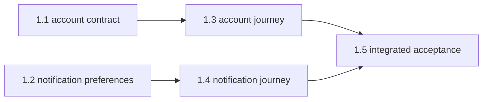

# Human plans and optimized execution slices

Parallel Slices planning has a human source and a compiled execution form:

1. The Markdown goal plan is written for people. It owns requirements, source
   traceability, decisions, preservation invariants, non-goals, architecture,
   risks, acceptance scenarios, rollout, and the milestone definition of done.
2. Version 2 scope manifests and version 5 JSON run state are optimized for
   controllers. They project the plan into bounded work, dependencies, path
   ownership, resource locks, gates, review artifacts, and durable progress.
3. When configured multi-agent review is enabled, a goal-level planning scope
   and review ledger let fresh AI reviewers audit that projection against the
   Product Plan and repository before any worker starts.

The execution files never replace or weaken the Product Plan. They reference
its stable requirement IDs instead of paraphrasing requirements. The human
approves and commits the Product Plan first. AI then combines it with the
selected Architecture Package and compiles manifests, initial state, and the
dependency graph as a separate machine-oriented commit. Those derived files are
validated but do not require a second human approval.

## Planning sequence

Use this order:

1. Complete product discovery and resolve consequential decisions.
2. Write the human-readable requirement inventory and preservation contract.
3. Define observable acceptance evidence at real product boundaries.
4. Present only the Product Plan for human approval.
5. Commit the approved Product Plan and record its full commit SHA.
6. Read the committed `sliceCompilation.sizingStrategy` and capture the
   compilation-input snapshot.
7. Identify the smallest coherent vertical outcomes, perform an explicit
   pairwise concurrency-discovery pass, and draft a dependency-minimal graph
   before applying the configured sizing strategy.
8. Trace each outcome forward through entry points, contracts, consumers, data
   side effects, tests, and operations, then reverse-trace proposed paths through
   references, importers, fixtures, generated outputs, and relevant history.
9. Record exact `coverage` dispositions and perform a separate read-only worker
   challenge proving the outcome does not require writes outside `allow`.
10. Add dependency edges only where a slice genuinely consumes an earlier
    accepted outcome and cannot implement and verify against an already
    committed contract, fixture, test double, or narrower prerequisite.
11. Separate worker-owned `allow` paths from root-owned `coordinate` paths.
12. Add logical locks for semantic resources that path matching cannot see.
13. Mark the exceptional slice that must run alone as `parallel=forbidden` and
    state the exact reason.
14. Run the serial-chain challenge against every dependency and inspect the
    computed graph analysis. A non-trivial all-serial first draft must be
    repartitioned whenever safe independence exists.
15. Generate version 5 JSON state covering every manifest, record the Product
    Plan approval SHA as `planCommit`, and preserve the strategy, input hashes,
    sizing rationale, exact dependency rationale, and any evidence-backed
    serial-only exception under `compilation`.
16. Add the goal-level `_planning.scope` when configured review is enabled,
    then validate and commit the compiled execution files separately.
17. Run the configured independent AI reviewers when enabled, commit their
    generated planning ledger separately, and verify its execution-map
    fingerprint before presenting the graph and initial Ready Slices.

Do not split work by file count alone. A good slice is a small, meaningful,
independently verifiable outcome. Keep tightly coupled frontend, backend, and
test changes together when separating them would produce unusable intermediate
states. Prefer concurrency only after correctness and cohesion.

## Scope coverage and impact closure

Every newly compiled manifest records at least one `coverage` entry for each
impact surface: `entrypoint`, `contract`, `consumer`, `data-side-effect`,
`test`, and `operations`. Each entry classifies an exact repository path as
`change` or `preserve`, or records `not-applicable|none` with a concrete reason.

The compiler derives these entries from repository evidence, not from the first
implementation idea. Trace forward from the accepted scenario and reverse from
each proposed path. Inspect shared request and response schemas, exported types,
callers and importers, persistence, external actions, fixtures, mocks, generated
files, documentation and release requirements, and useful Git co-change
history. Negative outcomes deserve the same trace as successful creation paths.

`allow` remains the sole write authorization. Validation requires every
`change` path to be allowed, every `preserve` path to exist and remain outside
worker scope, and every allow pattern to have at least one exact changed path.
Before committing the execution map, perform a separate read-only rehearsal
from the future worker packet and revise the map if the slice cannot deliver
its observable and preservation cases without another path.

## Configurable slice sizing

The selected Architecture Package installs a default in
`.parallel-slices/config.json`. A repository may override that value before
Product Plan approval:

```json
{
  "sliceCompilation": {
    "sizingStrategy": "throughput-balanced"
  }
}
```

`isolation-first` prefers the smallest coherent vertical outcomes that retain
independent evidence and bounded retries. `throughput-balanced` begins with the
same semantic outcomes, then coalesces compatible small work when the fixed
cost of another candidate pipeline, integrated pipeline, review, evidence
record, and commit exceeds the split's concurrency, dependency-unlock, or
retry-isolation value.

Neither setting changes gates, scope enforcement, locks, serialized
integration ownership, review, or final audit. The compiler must explain material
partitioning decisions in durable state rather than relying on chat memory or
invented timing estimates.

Both settings require useful safe concurrency, not merely several manifest
files. Before coalescing, the compiler compares outcomes pairwise and identifies
which can start from the same accepted base. Path overlap and shared locks may
serialize scheduler admission, but they do not establish a dependency edge.
“Implement the backend first,” “finish the data layer,” or another preferred
work order is not a dependency unless the downstream outcome cannot be built
and verified against committed contracts, fixtures, or test doubles.

After drafting the graph, the compiler challenges every dependency and runs
`slice-graph.mjs analyze`. A multi-slice graph with maximum parallel width one
must be decomposed again. It is accepted only when repository evidence proves
that every possible pair shares an unavoidable accepted-output constraint; the
version 5 state must record that exception as `serialOnlyJustification`.
Otherwise the field is `null`. Every remaining edge has a matching
`dependencyRationale` entry, and validation rejects missing, invented, or stale
edge evidence.

Sizing is performed by the AI planning workflow, not by the runtime scheduler.
The strategy is therefore a documented decision rubric rather than an automatic
wall-clock optimizer. Once the compiled execution commit exists, the scheduler
uses that immutable map and never silently resizes in-progress work.

## Dependency DAG

Each manifest declares `depends_on=none` or a comma-separated list of slice
IDs. The graph must be acyclic. A slice is ready only when all dependencies are
`accepted` in committed run state.



Here, 1.1 and 1.2 can start together. Their dependents become eligible only
after the relevant accepted commits reach the goal branch.

## Path ownership

`allow` lists everything a worker may change: implementation, tests, and its
unique release fragment. `coordinate` lists integration evidence written only
by the root or its configured review runner: the JSON run state and the
slice's unique JSON and Markdown review artifacts.

Workers may never edit coordination paths. This separation lets workers start
from the same goal-branch commit without conflicting over one ledger. The root
serially incorporates candidates and records progress.

Path isolation is necessary but not sufficient. Two slices may use disjoint
files while changing the same logical contract. Use `lock` for resources such
as:

- `workspace-dependencies` for package manifests and lockfiles;
- `authentication-contract` for shared identity/session behavior;
- `database-schema` for migrations and generated database types;
- `shared-api-contract` for request/response compatibility; or
- `root-quality-config` for repository-wide tooling.

Ready slices sharing a lock are serialized.

## How Ready Slices are derived

The scheduler calculates a set from committed manifests and state. It selects
ready slices in stable order and adds a slice only when:

```text
all dependencies are accepted
AND neither slice forbids parallel execution
AND worker-owned path patterns do not overlap
AND logical resource locks do not overlap
```

Expected concurrency may be shown after compilation, but it is not part of the
human-approved Product Plan or an independent scheduling source. The root
recalculates Ready Slices after every accepted slice so durable state and
manifests remain authoritative. A newly eligible slice may start while older
independent workers continue.

Validate and inspect a plan from the repository root:

```bash
node scripts/parallel-slices/slice-graph.mjs validate \
  --plan docs/plans/<plan>.md

node scripts/parallel-slices/slice-graph.mjs sets \
  --plan docs/plans/<plan>.md

node scripts/parallel-slices/slice-graph.mjs ready \
  --plan docs/plans/<plan>.md \
  --state docs/plans/loop-runs/<feature>-state.json
```

## Candidate and accepted commits

Each ready worker receives a fresh conversation and a detached worktree at the
current accepted goal-branch commit when that worker is created. Workers
started together normally share a base; a newly unlocked worker may start at a
newer accepted base while an older independent worker continues. Each worker
creates one gated candidate commit. Candidate commits are not pushed and do
not advance state.

The root verifies each candidate as it arrives. Once its dependencies are
accepted, an atomic claim gives that attempt exclusive ownership of the goal
checkout. The root then applies it, updates aggregate state, reruns the
integrated gate and review, and creates the accepted slice commit. It never
waits for every sibling worker before advancing an eligible candidate. This
serial integration step detects interactions that isolated worker gates cannot
prove away. One goal still has one branch and one pull request.

Ignored runtime tracking keeps this parallel work recoverable without turning
in-flight status into committed coordination churn. One runtime index names
separate worker and integration ledgers for every slice attempt. Pipeline
reruns append results, retries append attempts, and only the serial root
promotes accepted evidence into committed aggregate state. See
`docs/parallel-slices/robust-recovery.md`.

## When to serialize

Use a dependency edge when one outcome needs another. Use a shared lock when
independent-looking slices mutate the same semantic resource. Use
`parallel=forbidden` only when the slice must run alone for a reason that cannot
be expressed through dependencies, paths, or locks.

Common serial work includes initial package/lockfile setup, shared schema
changes, repository-wide configuration, migration ordering, and final
integrated acceptance. Independent product journeys, isolated packages, and
disjoint documentation or test assets are stronger parallel candidates.

## Correcting compilation

Before the compiled-execution commit, AI may regenerate, split, merge, or
reorder slices until the graph is valid and the Ready Slices are safe. After
that commit, Product Plans and compiled manifest revisions are immutable so
workers and branch policy share one stable contract.

An independent planning review or repository inspection may still discover an
omitted file before a slice has candidate evidence. When the requirement,
observable, subsystem, dependencies, locks, gate, release class, security and
privacy policy, migration boundary, deployment boundary, external actions, and
non-goals all remain unchanged, the controller may add an immutable consecutive
replacement revision. The correction commit contains exactly the replacement
manifest, its schema-valid evidence record, and that slice's state-pointer
reset. It may add only exact worker paths with exact changed coverage and may
not remove prior paths, locks, changed coverage, or preservation coverage.

The active graph uses the only unsuperseded revision. Its fingerprint makes the
prior planning approval stale, and workers remain barred until fresh AI
reviewers approve the corrected map. Any semantic, subsystem, policy,
migration, deployment, external-action, or non-goal change still requires a new
Product Plan and explicit human approval.
