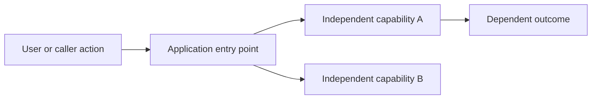

# <Feature> Product Plan

Status: DRAFT
Owner: <owner>
Milestone: <one bounded vertical outcome>
Goal branch: `<type>/<short-kebab-description>`

## Goal and user-visible outcome

<Describe what a user can do when this milestone is complete.>

## Context and current behavior

<Document the existing user experiences, entry points, components, services,
data stores, platforms, and tests that already own this behavior.>

## Requirements

Translate the approved product conversation and discovery answers into atomic,
testable requirements. Preserve important constraints and exceptions. After
approval, never renumber or reuse an ID.

| ID  | Formal requirement   | Source                            | Acceptance evidence         |
| --- | -------------------- | --------------------------------- | --------------------------- |
| R1  | <Stable requirement> | <Developer requirement or answer> | <Observable test or result> |
| R2  | <Stable requirement> | <Existing contract or inference>  | <Observable test or result> |

## Existing behavior to preserve

- P1: <Existing workflow or contract>
- P2: <Coexistence with another input path or feature>
- P3: <Mobile, desktop, accessibility, or theme behavior>

## Non-goals

- <Adjacent feature excluded from this milestone>
- <Refactor or platform hardening excluded from this milestone>
- <Policy or pricing change excluded from this milestone>

## Locked decisions

| Decision                           | Choice          | Reason     |
| ---------------------------------- | --------------- | ---------- |
| <Product or architecture question> | <Locked answer> | <Evidence> |

## Git and pull-request delivery

- Repository profile: `.parallel-slices/repository.json`
- Publication mode: `local-only` or `github`
- Goal branch: `<type>/<short-kebab-description>`
- Base branch: `<configured base branch>`
- Pull-request title: `<one title for the complete goal>`
- Pull-request outcome: <What the complete PR delivers>
- Human review: required once for the goal-level pull request, not per slice

## System interaction and dependency graph

State which operations can run concurrently. Document applicable identity,
caching, client/server, offline, background-work, loading, and error-state
ownership without assuming a particular application platform.

## Security and privacy model

- Authentication:
- Authorization and tenant isolation:
- Input validation:
- Server-only secrets and environment variables:
- Rate limits or abuse controls:
- Sensitive logging and analytics:

## Acceptance traceability

Every requirement must name observable acceptance evidence. The later AI
compilation step maps these stable IDs to executable slices without changing
their meaning. Do not include slice IDs, paths, locks, gates, or commit subjects
in the Product Plan.

| Requirement | Verified by                         |
| ----------- | ----------------------------------- |
| R1          | <Automated test or manual scenario> |
| R2          | <Automated test or manual scenario> |

## Contract and change-impact inventory

Name behavior-level owners and boundaries here, not executable file paths.
For each applicable requirement, trace the current entry point, public or
shared contract, direct consumers, durable-data or external side effects,
acceptance-test surface, and operational effect. State `Not applicable` with a
reason when a surface truly does not participate. The later compiler resolves
these named concerns to exact repository paths and records their disposition.

| Requirement | Entry point | Contract         | Consumers   | Data or side effects | Test surface        | Operations       |
| ----------- | ----------- | ---------------- | ----------- | -------------------- | ------------------- | ---------------- |
| R1          | <Boundary>  | <Named contract> | <Consumers> | <Mutation or none>   | <Evidence boundary> | <Effect or none> |
| R2          | <Boundary>  | <Named contract> | <Consumers> | <Mutation or none>   | <Evidence boundary> | <Effect or none> |

## Product acceptance scenarios

1. Given <state>, when <user action>, then <observable result>.
2. Given <preserved input path>, when <action>, then its behavior is unchanged.
3. Given each supported platform and accessibility input, then the workflow
   remains usable.
4. Given a failed or slow dependency, then the application exposes a bounded,
   recoverable result rather than hanging.
5. Given concurrent or repeated submissions, then mutations remain idempotent or
   safely reject duplicates.

## Rollout and compatibility

- Feature flags:
- Data migration:
- Backward compatibility:
- Runtime or deployment-target impact:
- Data schema, storage, or migration impact:
- Scheduled or background execution impact:
- Monitoring:
- Rollback:

## Definition of done

- Every requirement in this milestone has an observable result.
- Every preservation and coexistence scenario passes.
- Every required manual UAT or DEV/QA script follows
  `docs/testing/manual/AGENTS.md`, and its execution status is recorded.
- In GitHub mode, one goal-level pull request contains all slice commits and its
  required CI checks are green before human review.
- The completed goal contains evidence sufficient to audit every requirement.
- No excluded phase, path, or product policy changed.

## Approval record

- Approved scope:
- Approved by:
- Approval date:
- Approved repository publication mode:

After approval, set `Status: APPROVED` and commit this Product Plan without
scope manifests or run state. The compiled run state records that approval
commit as `planCommit`.
